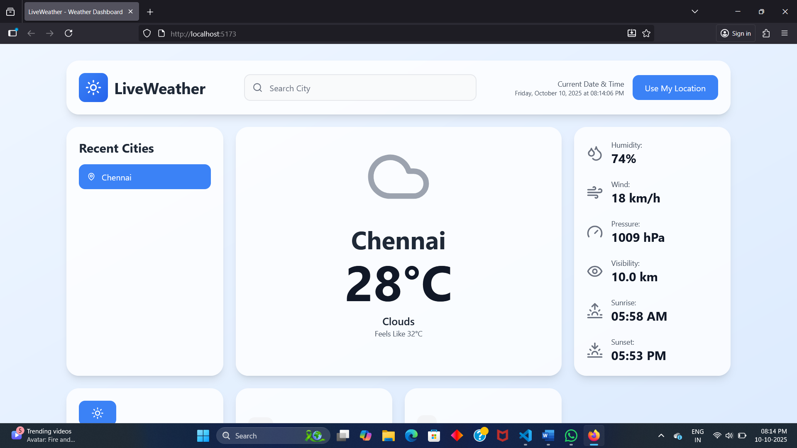

# 🌦️ Live Weather Dashboard
A responsive React + Vite web app that displays real-time weather data using the OpenWeather API.

[](LICENSE)
[](https://github.com/Yuvaraj7583/Live-Weather-Dashboard)

---

## 📑 Table of Contents
- [About](#about)
- [Features](#features)
- [Tech Stack](#tech-stack)
- [Installation](#installation)
- [Configuration](#configuration)
- [Usage](#usage)
- [Screenshots](#screenshots)
- [API Documentation](#api-documentation)
- [Challenges & Solutions](#challenges--solutions)
- [Deployment](#deployment)
- [Contributing](#contributing)
- [License](#license)
- [Contact](#contact)

---

## 🧩 About
**Live Weather Dashboard** is a React-based web application that allows users to view current weather conditions for any city.  
It uses the **OpenWeather API** and provides data such as temperature, humidity, wind speed, and weather descriptions in a modern, responsive interface.

---

## 🚀 Features
- Search for any city’s weather in real-time  
- Displays temperature, humidity, and wind speed  
- Responsive design using Tailwind CSS  
- Error handling for invalid city names  
- Fast performance powered by Vite  

---

## 🛠️ Tech Stack
- **React.js**
- **Vite.js**
- **Tailwind CSS**
- **Axios**
- **OpenWeather API**

---

## ⚙️ Installation

1. Clone this repository:
   ```bash
   git clone https://github.com/Yuvaraj7583/Live-Weather-Dashboard.git
2. Navigate to the project folder:
   ```bash
   cd Live-Weather-Dashboard
3. Install dependencies:
   ```bash
   npm install
4. Start the development server:
   ```bash
   npm run dev
5. Open the app in your browser at:
   ```bash
   http://localhost:5173

## 🔑 Configuration

Create a .env file in the root of your project and add my API KEY:    
    
     VITE_OPENWEATHER_API_KEY=My_api_key

## 🖥️ Usage

1. Enter the city name in the search bar.

2. Press Enter or click Search.

3. View live temperature, humidity, and weather conditions.

## 🖼️ Screenshots

Add screenshots of your project in a folder named screenshots/ in your repository, then reference them like this:


